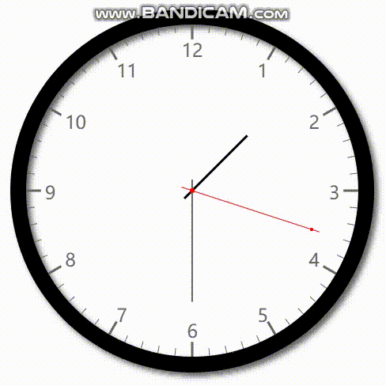
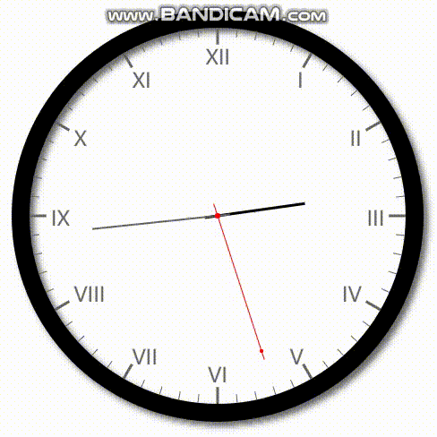
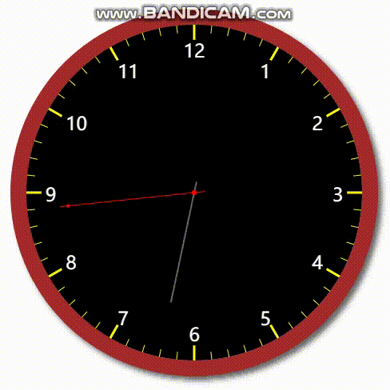
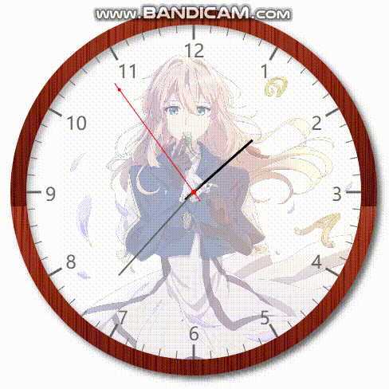
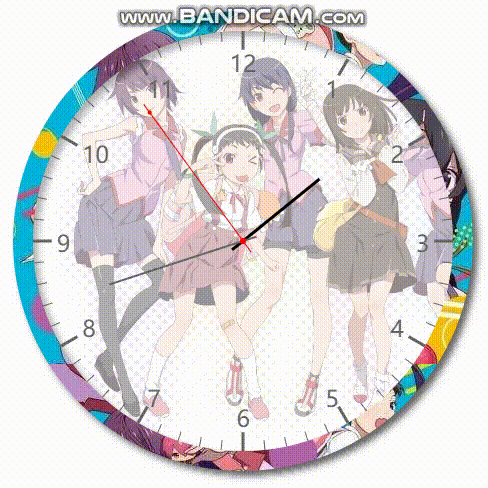

# 效果图


# 1.安装
* &lt;script&gt;标签引入"dist/clock.js"或"dist/clock.min.js"
+ 使用npm，运行命令：npm install -D concise-clock
# 2.例子
## 2.1 最简单使用
* 代码
```javascript
new Clock(document.getElementById("canvas")).run();
```
* 效果  
<br/>


## 2.2 显示罗马数字
* 代码
```javascript
new Clock(document.getElementById("canvas"), {scaleType: "roman"}).run();
```
* 效果  
<br/>


## 2.3 自定义边框颜色、背景色、刻度线颜色以及小时数字颜色
* 代码
```javascript
new Clock(
    document.getElementById("canvas"),
    {
        borderColor: "brown",//边框颜色
        backgroundColor:"black",//表盘背景色
        hourColor:"white",//小时数字颜色
        scaleColor:"yellow"//刻度线颜色
    }
).run();
```
* 效果
<br/>


## 2.4 自定义边框图片、背景图片
* 代码1
```javascript
new Clock(
    document.getElementById("canvas"),
    {
        borderImage: "./img/border.png",
        backgroundImage: "./img/bg.jpg"
    }
).run();
```
* 代码2 使用远程图片
```javascript
new Clock(
    document.getElementById("canvas"),
    {
        borderImage: "https://timgsa.baidu.com/timg?image&quality=80&size=b9999_10000&sec=1545553805386&di=ec656215a2958d617ef30631e96304e0&imgtype=0&src=http%3A%2F%2Fimg1.ali213.net%2Fshouyou%2Fupload%2Fimage%2F2018%2F07%2F09%2F584_2018070952816881.png",
        backgroundImage: "https://timgsa.baidu.com/timg?image&quality=80&size=b9999_10000&sec=1545553773235&di=1c768f80fc088c2edc20fa75af77c515&imgtype=0&src=http%3A%2F%2Fb-ssl.duitang.com%2Fuploads%2Fitem%2F201607%2F03%2F20160703164252_2WySB.jpeg"
    }
).run();
```
* 效果
<br/>
<div>
    
    
</div>

# 3.参数
## 3.1 Clock(canvas, options)
* canvas：顾名思义，canvas是一个HTMLCanvasElement对象，是用来显示模拟时钟的容器。
* options：options有默认值，可不传，但如果你想自定义一些漂亮的样式，就可以使用options参数。
## 3.2 options默认值
```javascript
{
    size: 500,//模拟时钟尺寸(px)
    padding: 5,//内边距
    borderWidth: 20,//边框宽度
    borderColor: "black",//边框颜色
    borderImage: undefined,//边框图，优先级高于borderColor
    scaleType: "arabic",//刻度值类型(arabic、roman、none),arabic:阿拉伯数字;roman:罗马数字; none:不显示;
    scaleColor: "#666",//刻度线颜色
    hourColor: "#666",//刻度值颜色
    backgroundColor: "white",//背景色
    backgroundImage: undefined,//背景图，优先级高于backgroundColor
    secondHandColor: "red",//秒针颜色
    minuteHandColor: "#666",//分针颜色
    hourHandColor: "black",//时针颜色
    backgroundMode: "full",//背景图显示模式
    backgroundAlpha: 0.5,//背景色透明度
    onload: undefined,//图片加载完成回调，回调参数当前Clock对象
}
```
# 4.对象方法
* show(time): 用来显示一个时间，可以是Date对象，也可以是形如"hh:mm:ss"的字符串，此的方法返回值是当前对象。例如:
```javascript
//1.如果没有用到背景图或边框图，那么可以直接使用show方法
new Clock(document.getElementById("canvas")).show("15:25:40");

//2.若使用了背景图或边框图，那么需要在onload回调方法中使用show方法
new Clock(
    document.getElementById("canvas"),
    {
        borderImage: "./img/border.png",
        backgroundImage: "./img/bg.jpg",
        onload(clock) {
            clock.show("15:25:40")
        }
    }
);

```
* run(): 执行此方法，模拟时钟就会每隔1秒，渲染一次界面，此方法返回值是当前对象。例如：
```javascript
new Clock(document.getElementById("canvas")).run();
```
* stop(): 执行此方法，可停止每隔1秒渲染界面。例如：
```javascript
//运行一个模拟时钟，4秒后停止
var clock = new Clock(document.getElementById("canvas")).run();
setTimeout(function(){
    clock.stop();
}, 4000);
```